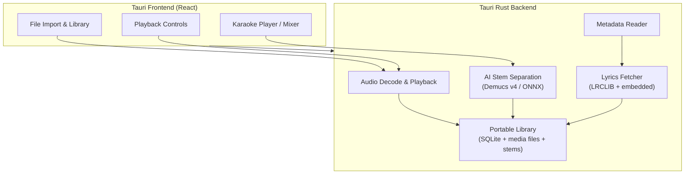

[简体中文](./README_CN.md)

<div align="center">


# OpenKara

**Turn your music library into a karaoke stage.**

An open-source desktop karaoke app powered by on-device AI stem separation and synced lyrics.

[](https://github.com/thedavidweng/OpenKara/actions/workflows/ci.yml)
[](./LICENSE)


</div>

---

## Demo

<div align="center">

[](https://youtu.be/OznVDmp9igk)

</div>

---

## Why I Built This

I love singing karaoke at home, but every existing solution has its own set of problems.

The most mature option is probably [Karafun](https://www.karafun.com/) — a paid service that sidesteps copyright by re-recording famous songs. That's neat, but it comes with issues:

1. Their re-recorded instrumentals inevitably sound a little different from the originals
2. Their catalog doesn't always include the niche songs I want to sing
3. I hate subscriptions

Then there's [Apple Music Sing](https://www.apple.com/ca/newsroom/2022/12/apple-introduces-apple-music-sing/), which offers on-device vocal removal for karaoke. Also neat — but Apple Music is yet another subscription, and I hate subscriptions.

To dodge the subscription trap, you could go the more traditional route — something like [OpenKJ](https://github.com/OpenKJ/OpenKJ) for playing CD+G/media+g files. But CD+G files are niche, hard to find, and have to be purchased separately.

That pretty much leaves scouring YouTube for karaoke videos of dubious origin and questionable copyright status. Not exactly a unified experience, and the song I want is missing half the time.

So my no-compromise solution was born: OpenKara uses open-source AI to separate the digital music you already own in unencrypted form — whether it's from CD rips, [Bandcamp](https://bandcamp.com/), [Qobuz](https://www.qobuz.com/), iTunes, or your local library's music service. I know there are plenty of people who, like me, prefer to buy once and own forever. OpenKara turns my existing music library into a karaoke library, so I don't have to pay for KTV, and my catalog is shaped by my own taste — not the mainstream.

## Features

- **Local Audio Import** — Use music you already own. No subscriptions, no repurchases.
- **AI Stem Separation** — Separate vocals and accompaniment on-device.
- **Streaming Playback** — Ring-buffer streaming decode with chunked cache, bandwidth-aware proxy mode for slow networks, and automatic retry with exponential backoff.
- **Remote Repositories** — Connect Google Drive, Dropbox, or WebDAV libraries. Refresh, publish, and reauthorize without losing local state.
- **Saved Playlists & Singer Rotation** — Create playlists, assign singers with round-robin queue rotation, and filter the queue by singer.
- **Synced Lyrics** — Load timed lyrics from online sources, embedded tags, or sidecar `.lrc` files.
- **Lyrics Romanization** — Automatic romanization for 13 languages including Mandarin, Cantonese, Japanese, Korean, and more. Per-song language override.
- **CD+G Sidecars** — Render same-name `.cdg` graphics during fullscreen playback when a track includes them.
- **AirPlay Casting** — Cast karaoke playback to AirPlay-compatible devices with audience streaming.
- **Portable Library** — Self-contained library directory that works on NAS, USB drives, and across machines.
- **Cross-Platform** — Available on macOS, Windows, and Linux.
- **4-Stem Mixer** — Individual volume control for vocals, drums, bass, and other instruments. Collapsible accompaniment slider with per-stem breakdown.
- **Dual Separation Modes** — Choose between 2-stem (vocals + accompaniment) or 4-stem (vocals + drums + bass + other). Upgrade individual songs from 2-stem to 4-stem on demand.
- **Efficient Stem Storage** — Separated stems are cached compactly to keep library storage practical.
- **Resumable Separation** — Per-chunk checkpointing means separation resumes from where it left off if the app is closed mid-process.

## OpenMusic Series

OpenKara is part of the **OpenMusic** series, alongside [OpenLoop](https://github.com/thedavidweng/OpenLoop).

| Project                                              | Purpose                                                                                  | Status               |
| ---------------------------------------------------- | ---------------------------------------------------------------------------------------- | -------------------- |
| OpenKara                                             | Turn local songs into karaoke tracks with on-device AI stem separation and synced lyrics | Active               |
| [OpenLoop](https://github.com/thedavidweng/OpenLoop) | Generate new music locally from prompts, lyrics, and musical parameters                  | Alpha in development |

The shared philosophy is simple: music tools should be local-first, ownership-friendly, transparent, and useful with the media and hardware you already have.

---

## Quick Start

### Install from Release

Download the latest build for your platform from [GitHub Releases](https://github.com/thedavidweng/OpenKara/releases):

| Platform              | Format                  |
| --------------------- | ----------------------- |
| macOS (Apple Silicon) | `.dmg`                  |
| macOS (Intel)         | `.dmg`                  |
| Windows               | `.exe` (NSIS installer) |
| Linux                 | `.AppImage` / `.deb`    |

**macOS (Homebrew):**

```bash
brew install thedavidweng/tap/openkara
```

**Windows (winget):**

```bash
winget install thedavidweng.OpenKara
```

**macOS Gatekeeper note:** If macOS says the app is damaged or can't be opened, run:

```bash
xattr -rd com.apple.quarantine /Applications/OpenKara.app
```

**Windows SmartScreen note:** OpenKara isn't code-signed yet, so Windows may show a "Windows protected your PC" screen on first run. Click **More info**, then **Run anyway** to launch it.

On first launch, OpenKara will prompt you to create a Karaoke Library and start downloading the default AI model in the background.

### Build from Source

**Prerequisites:**

- [Node.js](https://nodejs.org/) 24（与 CI 一致；仓库根目录含 `.nvmrc`）
- [pnpm](https://pnpm.io/) 10+
- [Rust](https://rustup.rs/) stable toolchain
- Platform dependencies for [Tauri 2](https://v2.tauri.app/start/prerequisites/)

```bash
git clone https://github.com/thedavidweng/OpenKara.git
cd OpenKara
pnpm install
./scripts/setup.sh      # downloads Demucs ONNX model for local dev
pnpm tauri dev
```

To bundle the official desktop OAuth app registrations into a release build, set
`OPENKARA_GOOGLE_DRIVE_OAUTH_CLIENT_JSON` or
`OPENKARA_GOOGLE_DRIVE_OAUTH_CLIENT_JSON_PATH` for Google Drive and
`OPENKARA_DROPBOX_APP_KEY` plus `OPENKARA_DROPBOX_APP_SECRET` for Dropbox
before `pnpm tauri build`.
Dropbox sign-in uses the fixed loopback callback
`http://localhost:53682/oauth2/callback`; add that exact URI, including the
path, in the Dropbox developer console for the app.
The Dropbox app only needs `files.metadata.read`, `files.content.read`, and
`files.content.write`. Metadata read access is used to detect library files and
remote revisions, content read access downloads remote database/media/stem files,
and content write access creates folders plus uploads or deletes library files.
It does not need `account_info.read` or `files.metadata.write`.
OpenKara treats per-user refresh/access tokens as secrets and stores them in
the OS credential store; for desktop apps, an OAuth `client_secret` shipped in
the app bundle itself still cannot be treated as confidential against the end
user.

### App Icon

- Source icon: `src-tauri/icons/app-icon.png` (`1024x1024` master asset)
- Regenerate all platform icons with `pnpm icons:generate`
  - Raster icons (`icon.icns`, PNG sizes, Windows/Android/iOS) come from `tauri icon`
  - On macOS, the same command also compiles `src-tauri/icons/OpenKara.icon` into `Assets.car` (Liquid Glass, macOS 26+) via Xcode `actool`
- Generated assets are written to `src-tauri/icons/` for Tauri desktop and future mobile targets
- macOS 26 uses `Assets.car` + `CFBundleIconName=OpenKara`; older macOS versions fall back to the legacy `icon.icns` raster

## AI Models

OpenKara uses custom ONNX builds of [Demucs](https://github.com/adefossez/demucs) models for stem separation. Models are maintained in a separate repository:

**[openkara-models](https://github.com/thedavidweng/openkara-models)** — Reproducible ONNX model conversion pipeline

| Model         | Description                                | Input                           | Output                              | Format          |
| ------------- | ------------------------------------------ | ------------------------------- | ----------------------------------- | --------------- |
| `htdemucs`    | Standard — Hybrid Transformer Demucs       | Stereo audio at 44.1 kHz (7.8s) | 4 stems: drums, bass, other, vocals | ONNX (opset 17) |
| `htdemucs_ft` | High Quality — Fine-tuned 4-model ensemble | Stereo audio at 44.1 kHz (7.8s) | 4 stems: drums, bass, other, vocals | ONNX (opset 17) |

On first launch, OpenKara automatically downloads the standard `openkara-models` asset pinned by the app's embedded catalog snapshot (currently generation 9) into the app data directory. Settings offers an update check that installs newer catalog generations without waiting for an app release. The current standard model is ~199.8 MiB on disk, and the optional high quality model is ~800.1 MiB. Both assets are ONNX Runtime-optimized and carry metadata used for cache invalidation. See the [openkara-models README](https://github.com/thedavidweng/openkara-models#readme) for details on the conversion pipeline. For local development and deterministic tests, run `./scripts/setup.sh` to populate `src-tauri/models/`.

## Tech Stack

| Layer             | Technology                                                                                              | Purpose                         |
| ----------------- | ------------------------------------------------------------------------------------------------------- | ------------------------------- |
| Desktop framework | [Tauri 2](https://github.com/tauri-apps/tauri)                                                          | Rust backend + system WebView   |
| Frontend          | [React](https://github.com/facebook/react) 19 + [TypeScript](https://github.com/microsoft/TypeScript) 5 | UI components                   |
| Bundler           | [Vite](https://github.com/vitejs/vite) 8                                                                | Dev server and build            |
| Styling           | [Tailwind CSS](https://github.com/tailwindlabs/tailwindcss) 4                                           | Utility-first CSS               |
| State             | [Zustand](https://github.com/pmndrs/zustand)                                                            | Lightweight global state        |
| Audio decode      | [symphonia](https://github.com/pdeljanov/Symphonia)                                                     | Pure-Rust codec support         |
| Audio output      | [cpal](https://github.com/RustAudio/cpal)                                                               | Cross-platform audio playback   |
| AI inference      | [ONNX Runtime](https://github.com/microsoft/onnxruntime) via [ort](https://github.com/pykeio/ort)       | Demucs v4 stem separation       |
| Lyrics            | [LRCLIB](https://lrclib.net/)                                                                           | Open synced lyrics API          |
| Metadata          | [lofty](https://github.com/Serial-ATA/lofty-rs)                                                         | ID3v2, Vorbis, FLAC tag reading |
| Audio encode      | [vorbis_rs](https://github.com/ComunidadAylas/vorbis-rs)                                                | OGG/Vorbis stem compression     |
| Database          | [SQLite](https://github.com/sqlite/sqlite) via [rusqlite](https://github.com/rusqlite/rusqlite)         | Song, lyrics, and stems cache   |

## Architecture



## Supported Formats

| Format       | Import | CD+G Graphics                  | Stem Separation |
| ------------ | ------ | ------------------------------ | --------------- |
| MP3          | ✅     | Same-name `.cdg` sidecar       | ✅              |
| FLAC         | ✅     | Same-name `.cdg` sidecar       | ✅              |
| WAV          | ✅     | Same-name `.cdg` sidecar       | ✅              |
| OGG / Vorbis | ✅     | Same-name `.cdg` sidecar       | ✅              |
| AAC / M4A    | ✅     | Same-name `.cdg` sidecar       | ✅              |
| MP3+G ZIP    | ✅     | Embedded audio + `.cdg` bundle | N/A             |

OpenKara imports same-name audio + `.cdg` pairs as managed CD+G tracks, and it can also import MP3+G ZIP archives directly. Standard audio tracks are resampled to 44.1 kHz stereo for the Demucs model. Managed CD+G tracks already contain accompaniment-only audio, so they skip stem separation.

## Portable Library

OpenKara stores all data in a self-contained library directory:

```
MyKaraokeLibrary/
├── .openkara-library       # marker file
├── openkara.db             # SQLite database
├── media/                  # imported standard audio copies
│   └── {hash}.mp3
├── media-g/                # managed CD+G assets
│   ├── {hash}.mp3          # paired audio for CD+G playback
│   ├── {hash}.cdg          # paired CD+G graphics sidecar
│   └── {hash}.zip          # MP3+G ZIP archive when imported as a bundle
└── stems/                  # separated tracks for standard audio imports
    └── {hash}/
        ├── vocals.ogg
        ├── accompaniment.ogg   # 2-stem mode
        ├── drums.ogg           # 4-stem mode
        ├── bass.ogg            # 4-stem mode
        └── other.ogg           # 4-stem mode
```

All paths in the database are relative — including CD+G sidecars and MP3+G ZIP assets — so the whole library can be moved to a NAS, USB drive, or network share and opened by any OpenKara instance on any OS. Per-machine configuration (library location) is stored separately in the app data directory.

## Reporting a Bug

OpenKara writes a rolling log file (info level by default, errors always) so a
problem can be diagnosed after the fact — even when the app was double-clicked
and had no terminal attached. Logs rotate daily and the last 7 days are kept.

When filing an issue, please include your **debug info** and, if relevant,
attach the **log file**:

1. Open **Settings → About** and click **Copy debug info**. Paste the result
   into your report — it lists the app version, build SHA, OS/architecture,
   catalog generation, model and runtime status, execution provider, and the
   log-file path. (On macOS the same export is also available from
   **Help → Copy Debug Info**.)
2. Attach the current log file if the problem is reproducible.

Log file location (`<date>` is the rotation day, e.g. `2026-07-25`):

| Platform | Path                                                           |
| -------- | -------------------------------------------------------------- |
| macOS    | `~/Library/Logs/com.openkara.desktop/openkara.<date>.log`      |
| Windows  | `%LOCALAPPDATA%\com.openkara.desktop\logs\openkara.<date>.log` |
| Linux    | `~/.local/share/com.openkara.desktop/logs/openkara.<date>.log` |

To raise verbosity for a repro, launch OpenKara with `OPENKARA_LOG=debug` (or a
[`tracing`](https://docs.rs/tracing-subscriber/latest/tracing_subscriber/filter/struct.EnvFilter.html)
filter such as `OPENKARA_LOG=openkara_lib=trace,warn`).

## Roadmap

- **[Changelog](./CHANGELOG.md)** — Completed changes by version
- **[GitHub Project](https://github.com/users/thedavidweng/projects/2/views/1)** — Future work and prioritization

---

## Development

### Prerequisites

- Node.js 24（`nvm use` 或 `fnm use` 读取 `.nvmrc` / `.node-version`）
- pnpm 10+
- Rust stable via [rustup](https://rustup.rs/)
- [Tauri 2 prerequisites](https://v2.tauri.app/start/prerequisites/) for your platform

### Setup

```bash
nvm use          # 或 fnm use — 读取 .nvmrc / .node-version
pnpm install
./scripts/setup.sh          # download Demucs ONNX model to src-tauri/models/
pnpm tauri dev               # start dev server with hot reload
```

`scripts/setup.sh` places the model in `src-tauri/models/` for local development and deterministic testing only. End-user installs use the app data directory for runtime model downloads.

### Running Tests

```bash
cd src-tauri && cargo test -q   # backend tests (175+; see AGENTS.md for CI notes)
pnpm lint                    # oxlint
pnpm format                  # oxfmt check
```

### Building

```bash
pnpm tauri build             # production build with platform-specific bundle
```

### CI/CD

- Pushes to `main` trigger the CI workflow ([`.github/workflows/ci.yml`](./.github/workflows/ci.yml)) — lint, build, and test on macOS, Windows, and Linux.
- Pushing a version tag (e.g. `v0.9.0`) triggers the release workflow ([`.github/workflows/release.yml`](./.github/workflows/release.yml)) — builds and attaches binaries to a GitHub Release.

## Documentation

- [Changelog](./CHANGELOG.md) — Shipped changes and version notes
- [IPC Contracts](./docs/references/contracts/) — Stable backend-facing interfaces
- [Product Specs](./docs/references/product/) — User-facing behavior specs

## Contributing

Contributions are welcome! Please open an issue before starting major changes so we can discuss the approach.

1. Fork the repository
2. Create a feature branch (`git checkout -b feature/my-feature`)
3. Make your changes and ensure tests pass (`cargo test`)
4. Submit a pull request

## Acknowledgments

- [Demucs](https://github.com/adefossez/demucs) — AI stem separation model by Meta Research
- [openkara-models](https://github.com/thedavidweng/openkara-models) — ONNX model conversion pipeline for OpenKara
- [demucs.onnx](https://github.com/sevagh/demucs.onnx) — Reference for STFT/ISTFT to real-valued ONNX conversion
- [LRCLIB](https://lrclib.net) — Open synced lyrics API
- [monochrome](https://github.com/monochrome-music/monochrome) — Lyrics sync and LRCLIB integration reference
- [amll-ttml-db](https://github.com/amll-dev/amll-ttml-db) — Community-maintained word-by-word lyrics database (CC0)
- [AMLL (Apple Music-like Lyrics)](https://github.com/amll-dev/applemusic-like-lyrics) — Lyrics rendering techniques (karaoke fill, spring physics, glow effects)

## License

[Apache License 2.0](./LICENSE) — Copyright (c) 2025 David Weng
